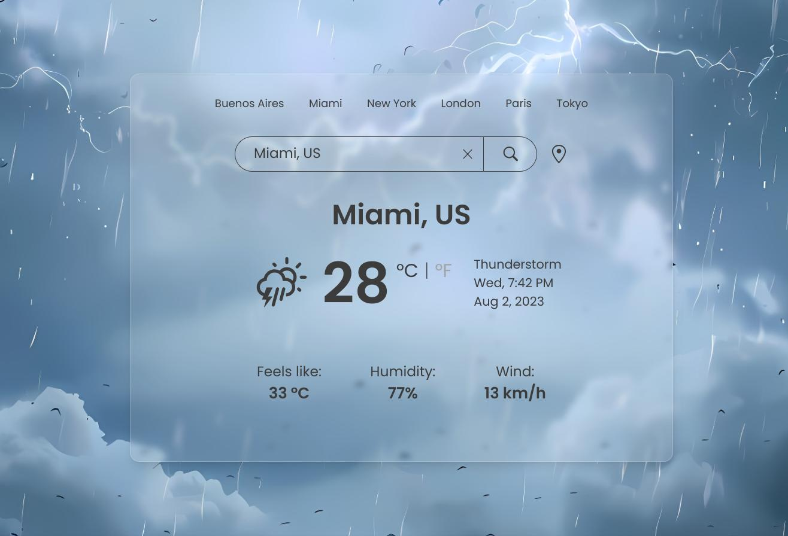

# Weather App

Welcome to my Weather App repository! This is a quick tool to check the weather of any city with the OpenWeatherMap API. It uses dynamic AI images to represent the weather conditions. Check out the live version by clicking [here](https://vlas-dev.github.io/weather-app/).



## 🌟 Features

- **Search:** Easily search for any city's weather information.
- **Weather Details:** View detailed weather information such as temperature, humidity, and wind speed.
- **Dynamic Images:** Visually appealing and accurate representations of the current weather using AI-generated images.

## 🛠 Technologies Used

- HTML5
- CSS3
- JavaScript
- Tailwind CSS
- React
- OpenWeatherMap API

## 💻 Local Development

To run this project locally, follow these steps:

#### 1. Clone the Repository:
```bash
git clone git@github.com:vlas-dev/weather-app.git
cd portfolio
```
#### 2. Install Dependencies:
```bash
npm install
```
#### 3. Start the Development Server:
```bash
npm start
```

The site should now be running at http://localhost:3000.

## 🚀 Deployment
This site is hosted using GitHub Pages.

## 🤝 Contributions
While this is a personal project, if you find any bugs or areas for improvement, please feel free to open an issue or create a pull request.

## ✉️ Contact & Support
If you have any questions, feel free to reach out to me at [musiccofabian@gmail.com](mailto:musiccofabian@gmail.com) or connect with me on [LinkedIn](https://www.linkedin.com/in/fabi%C3%A1n-musicco-a164231b4/).
